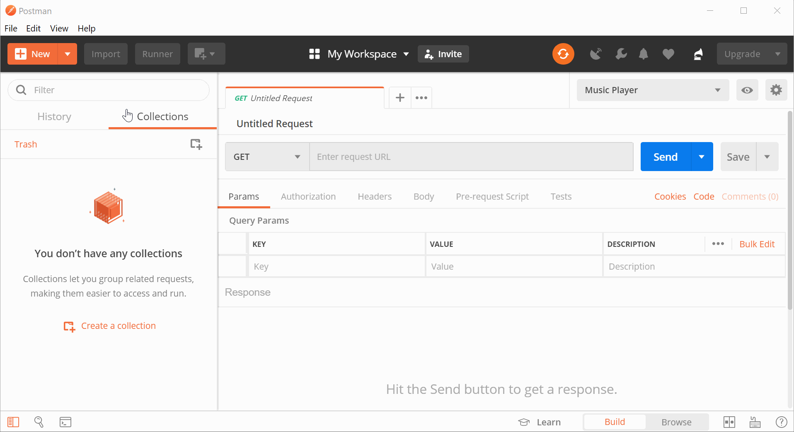

# musicplayer-server

[](https://travis-ci.org/dsaltares/musicplayer-server)
[](https://codecov.io/gh/dsaltares/musicplayer-server)

Backend for a simple music player app written in [Node.js](https://nodejs.org/en/) using [Express](https://expressjs.com/). It gets a list of tracks from a folder in the user's Google Drive account and fetches track metadata from [Last.fm](https://www.last.fm/api).

## Setup

To get started, install the service dependencies.

```bash
npm install
```

## Tests and linting

The service uses [Jest](https://jestjs.io/) as its testing Framework, to run tests and get a coverage report you can simply:

```bash
npm run test
```

For linting.

```bash
npm run lint
```

## Running the service

Get an API account for Last.fm [here](https://www.last.fm/api/account/create), copy the key and put it in a `lastfm_api_key.txt` file in the root of the repository.

Download the Google Drive client configuration from [Google's quickstart guide](https://developers.google.com/drive/api/v3/quickstart/nodejs). Add it as a `google_credentials.json` file to the repository root.

Now you can run the service via:

```bash
npm run start
```

You should see this in your console:

```bash
Server started and listening to requests on port 8080
```

It is now accessible via `http://localhost:8080`.

## Sending requests

First, you need to obtain and authorization token to allow the service to access your Google Drive files (read-only). In order to do that:

1. Run `node src/getgoogletoken.js`
2. Visit the URL it outputs and authorize the application.
3. Copy the code and paste it into the script prompt.
4. Copy and save the final script output.

You can now easily send requests to the service using [Postman](https://www.getpostman.com/) and importing the `musicplayer.postman_collection.json` file in the repository root.

You need to setup an environment variable called `google_token` and set its value to the output of the `getgoogletoken.js` script.



## API methods

The API only supports the `get` method.

### tracks

Retrieves all tracks inside the `musicplayer` folder in your Google Drive account that match the `Artist - Track Name.mp3` pattern. It then enriches the list with Last.fm metadata.

#### Params

None.

#### Headers

* `google_token`: the Google Drive authorization token for the user.

#### Sample Response

```json
{
    "tracks": [
        {
            "name": "Used Me",
            "id": "1VTENXdyQ8NclpQcpscrQjcjMrXKkX52G",
            "url": "https://www.last.fm/music/The+Spin+Wires/_/Used+Me",
            "duration": "306000",
            "streamable": {
                "#text": "0",
                "fulltrack": "0"
            },
            "listeners": "45",
            "playcount": "214",
            "artist": {
                "name": "The Spin Wires",
                "url": "https://www.last.fm/music/The+Spin+Wires"
            },
            "album": {
                "artist": "The Spin Wires",
                "title": "The Spin Wires",
                "url": "https://www.last.fm/music/The+Spin+Wires/The+Spin+Wires",
                "image": [
                    {
                        "#text": "https://lastfm-img2.akamaized.net/i/u/34s/1379c42585c9765db7eaf4fda718f1df.png",
                        "size": "small"
                    },
                    {
                        "#text": "https://lastfm-img2.akamaized.net/i/u/64s/1379c42585c9765db7eaf4fda718f1df.png",
                        "size": "medium"
                    },
                    {
                        "#text": "https://lastfm-img2.akamaized.net/i/u/174s/1379c42585c9765db7eaf4fda718f1df.png",
                        "size": "large"
                    },
                    {
                        "#text": "https://lastfm-img2.akamaized.net/i/u/300x300/1379c42585c9765db7eaf4fda718f1df.png",
                        "size": "extralarge"
                    }
                ]
            },
            "toptags": {
                "tag": [
                    {
                        "name": "alternative rock",
                        "url": "https://www.last.fm/tag/alternative+rock"
                    },
                    {
                        "name": "indie rock",
                        "url": "https://www.last.fm/tag/indie+rock"
                    }
                ]
            }
        }
    ]
}
```

#### Errors

In case of error, the service will return.

```json
{
    "error": {
        "msg": "Error message"
    }
}
```

### track

Returns the mp3 stream for the given track id.

#### Params

* `id`: the Google Drive file id as returned by the `tracks` request.

#### Headers

* `google_token`: the Google Drive authorization token for the user.


#### Errors

In case of error, the service will return.

```json
{
    "error": {
        "msg": "Error message"
    }
}
```

## Potential improvements

### Technical

* Better error handling with documented error codes.
* Higher unit test coverage.
* Integration tests.
* Decent logging and metrics for telemetry.
* Load tests.


### Features

* Configurable Google Drive folder.
* Different storage options: local, Dropbox...
* Ability to fetch lyrics.
* Pagination for large collections: at the moment, it only fetches the first page of Google Drive result (100 entries).
